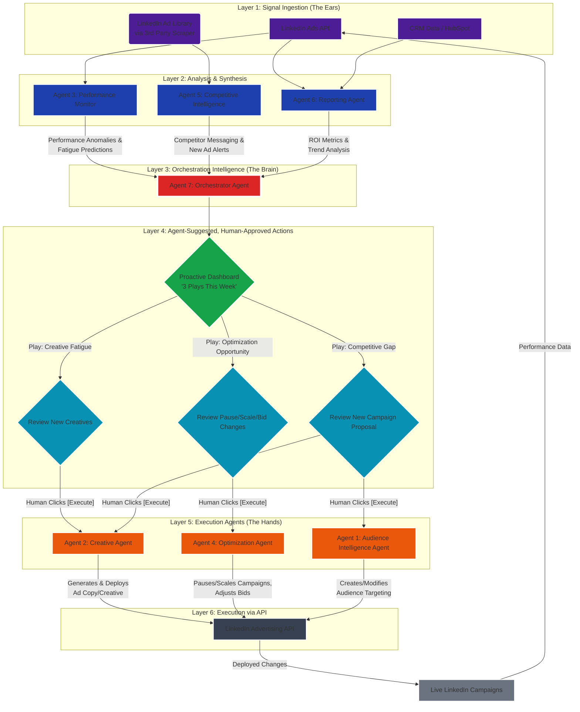

```mermaid
flowchart TD
    subgraph "Layer 1: Signal Ingestion (The Ears)"
        direction LR
        A1[LinkedIn Ads API]
        A2[CRM Data / HubSpot]
        A3(LinkedIn Ad Library<br/>via 3rd Party Scraper)
    end

    subgraph "Layer 2: Analysis & Synthesis"
        direction TB
        B1[Agent 3: Performance Monitor]
        B2[Agent 5: Competitive Intelligence]
        B3[Agent 6: Reporting Agent]
        
        A1 --> B1
        A3 --> B2
        A1 --> B3
        A2 --> B3
    end

    subgraph "Layer 3: Orchestration Intelligence (The Brain)"
        C1[Agent 7: Orchestrator Agent]
        B1 -- Performance Anomalies &<br/>Fatigue Predictions --> C1
        B2 -- Competitor Messaging &<br/>New Ad Alerts --> C1
        B3 -- ROI Metrics &<br/>Trend Analysis --> C1
    end
    
    C1 --> D1{"Proactive Dashboard<br/>'3 Plays This Week'"}

    subgraph "Layer 4: Agent-Suggested, Human-Approved Actions"
        direction TB
        D1 -- Play: Creative Fatigue --> E1{Review New Creatives}
        D1 -- Play: Optimization Opportunity --> E2{Review Pause/Scale/Bid Changes}
        D1 -- Play: Competitive Gap --> E3{Review New Campaign Proposal}
    end

    subgraph "Layer 5: Execution Agents (The Hands)"
        direction LR
        F1[Agent 2: Creative Agent]
        F2[Agent 4: Optimization Agent]
        F3[Agent 1: Audience Intelligence Agent]
    end

    E1 -- Human Clicks [Execute] --> F1
    E2 -- Human Clicks [Execute] --> F2
    E3 -- Human Clicks [Execute] --> F3 & F1

    subgraph "Layer 6: Execution via API"
        G1[LinkedIn Advertising API]
    end

    F1 -- Generates & Deploys<br/>Ad Copy/Creative --> G1
    F2 -- Pauses/Scales Campaigns,<br/>Adjusts Bids --> G1
    F3 -- Creates/Modifies<br/>Audience Targeting --> G1

    G1 -- Deployed Changes --> H1[Live LinkedIn Campaigns]

    H1 -- Performance Data --> A1

    %% Styling
    style A1 fill:#4c1d95,stroke:#fff,stroke-width:2px
    style A2 fill:#4c1d95,stroke:#fff,stroke-width:2px
    style A3 fill:#4c1d95,stroke:#fff,stroke-width:2px
    
    style B1 fill:#1e40af,stroke:#fff,stroke-width:2px
    style B2 fill:#1e40af,stroke:#fff,stroke-width:2px
    style B3 fill:#1e40af,stroke:#fff,stroke-width:2px

    style C1 fill:#dc2626,stroke:#fff,stroke-width:4px
    
    style D1 fill:#16a34a,stroke:#fff,stroke-width:2px
    
    style E1 fill:#0891b2,stroke:#fff,stroke-width:2px
    style E2 fill:#0891b2,stroke:#fff,stroke-width:2px
    style E3 fill:#0891b2,stroke:#fff,stroke-width:2px

    style F1 fill:#ea580c,stroke:#fff,stroke-width:2px
    style F2 fill:#ea580c,stroke:#fff,stroke-width:2px
    style F3 fill:#ea580c,stroke:#fff,stroke-width:2px

    style G1 fill:#374151,stroke:#fff,stroke-width:2px
    style H1 fill:#6b7280,stroke:#fff,stroke-width:2px
```
